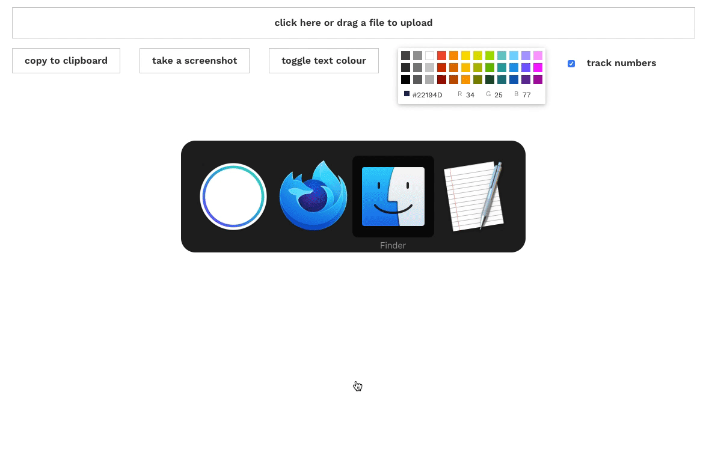

# tracklister

A simple app to turn .txt files exported from [Rekordbox](https://rekordbox.com/en/) and .nml files exported from [Traktor](https://en.wikipedia.org/wiki/Traktor) into beautiful tracklists. Built with [React](https://reactjs.org/).

## Usage

[Visit the site](https://tracklister.club/).

## Author

- [Ewen](https://www.ewen.io)

## License

This project is open source and available under the [MIT License](LICENSE).
